# 🖥️ OpenBI Desktop

> **Native Linux desktop client for [OpenBI](https://github.com/adnanphp/openbi) — an end-to-end Business Intelligence platform.**

[](https://github.com/adnanphp/openbi-desktop/releases)
[](https://github.com/adnanphp/openbi-desktop/actions/workflows/release.yml)
[](LICENSE)

**Download:** [OpenBI Desktop Releases](https://github.com/adnanphp/openbi-desktop/releases/latest) — one AppImage, no installation required.

---

## ✨ What Is OpenBI Desktop?

**OpenBI Desktop** is a native Linux desktop application built with **PySide6 / Qt 6** that connects to an OpenBI API backend and provides an interactive interface for business intelligence and analytics.

It provides access to:

* 📊 **Executive KPIs** — revenue, profit, margin, and orders
* 👥 **Customer Intelligence** — RFM segments with revenue breakdown
* 📈 **Sales Forecasting** — multi-model comparison using ETS, XGBoost, and baseline forecasting
* 📅 **Monthly Trends** — 48-month revenue visualization

### Thin-Client Architecture

OpenBI Desktop is intentionally a **thin client**.

The desktop application handles the user interface and communicates with the OpenBI backend over HTTP. Data processing, machine learning, and analytics remain on the backend.

```text
OpenBI Desktop
     │
     │ HTTP
     ▼
OpenBI FastAPI Backend
     │
     ├── PostgreSQL
     ├── Spark
     ├── Kafka
     ├── dbt
     ├── Airflow
     └── Analytics / ML
```

The desktop app is the **face of OpenBI**; the backend performs the computation.

---

# 📸 Screenshots

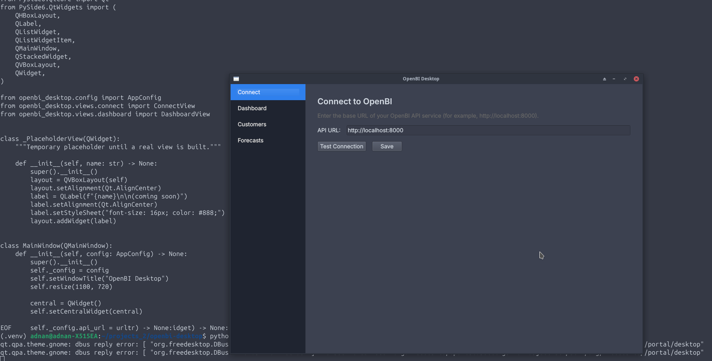

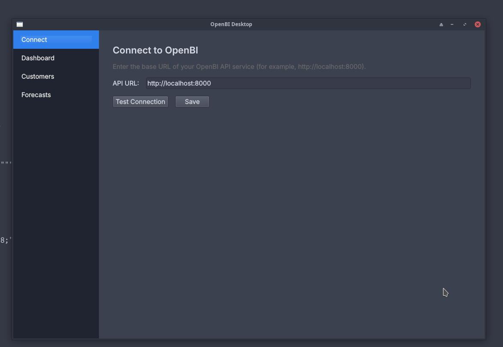

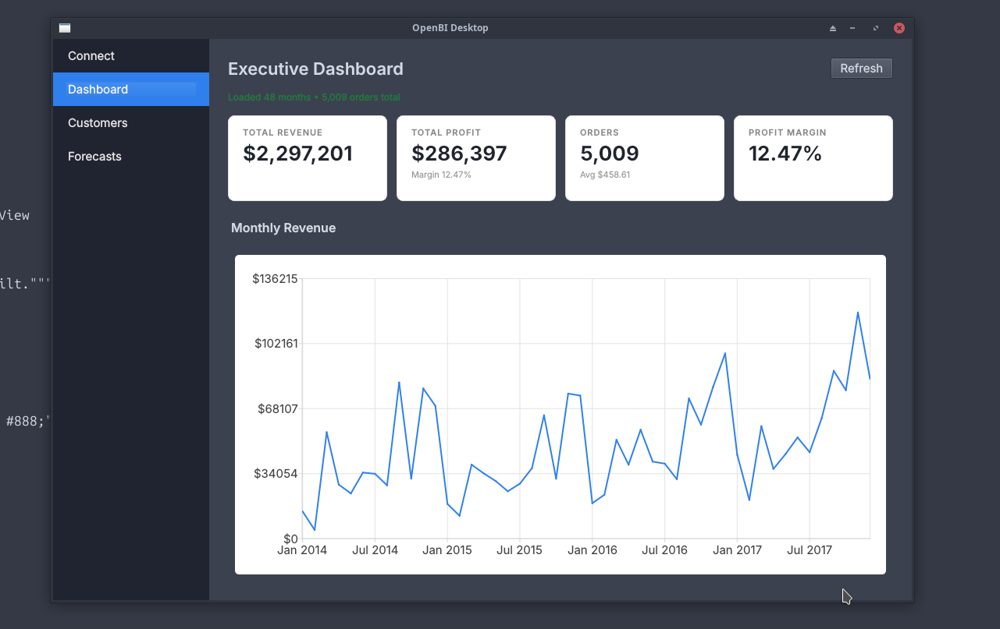

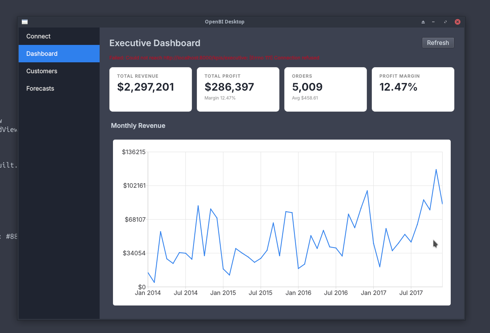

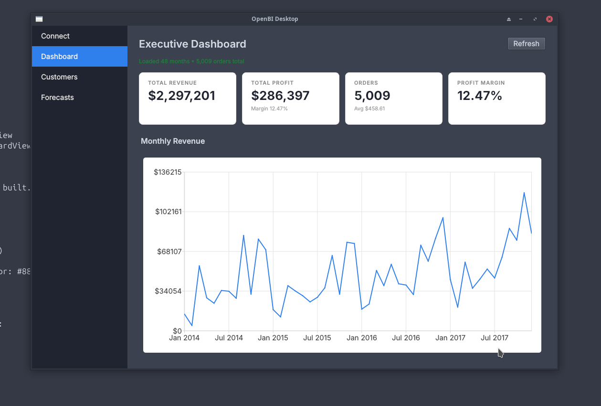

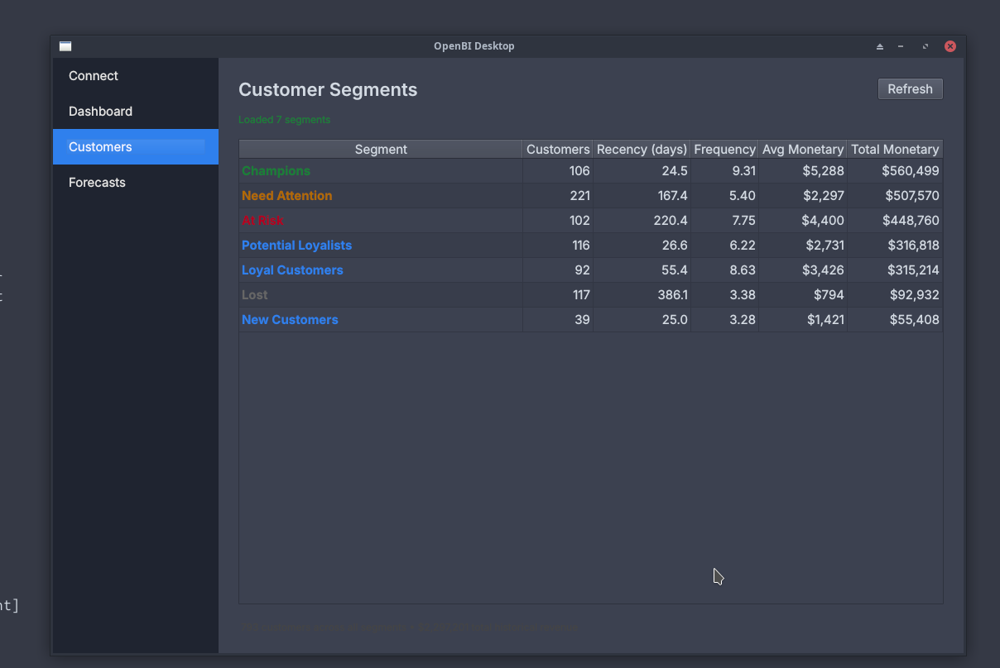

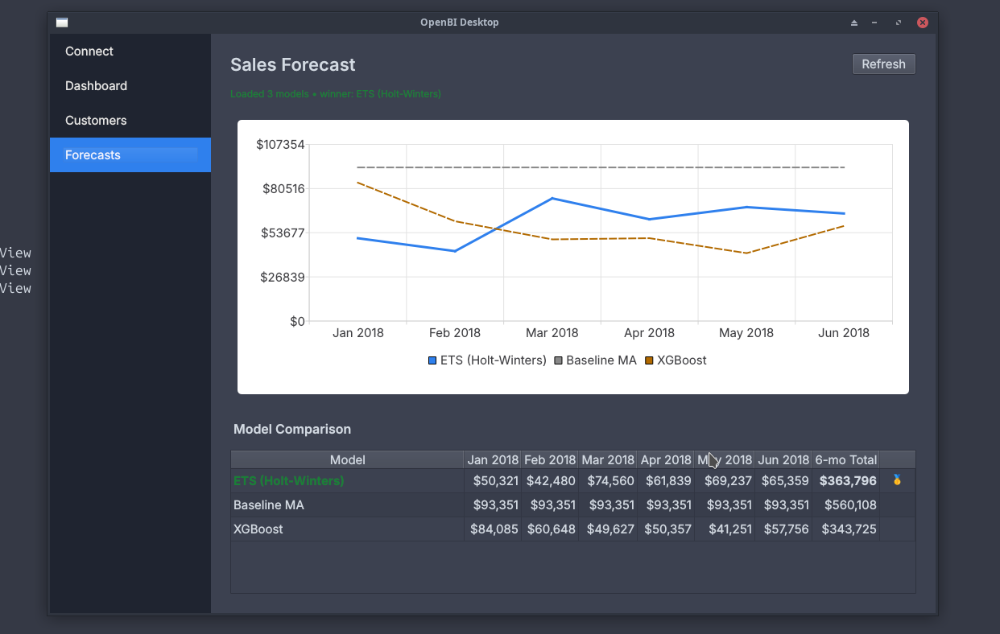

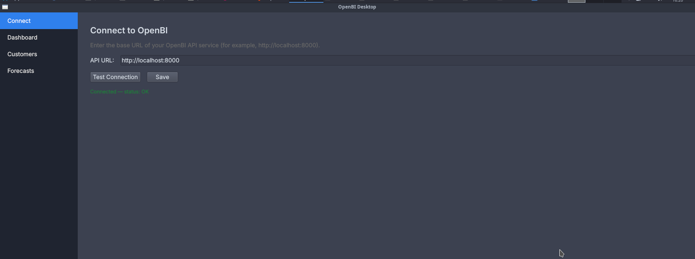

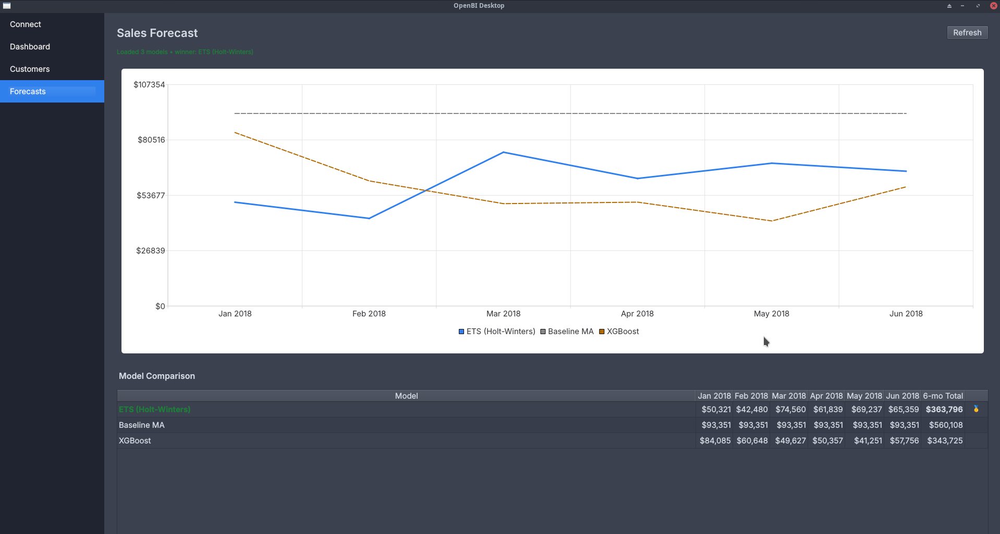

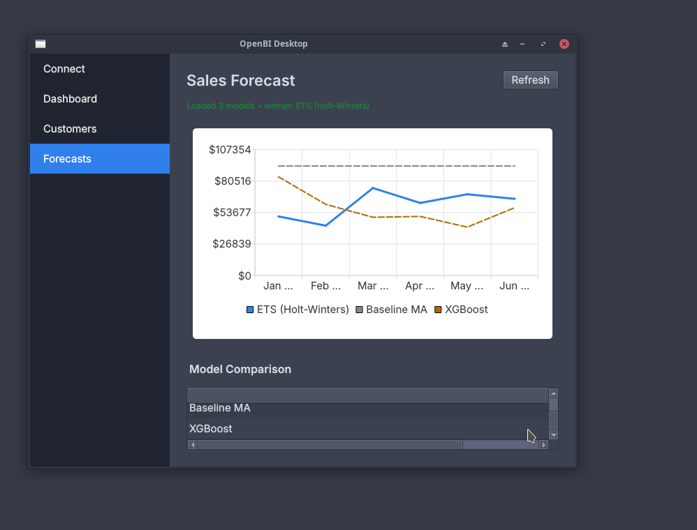

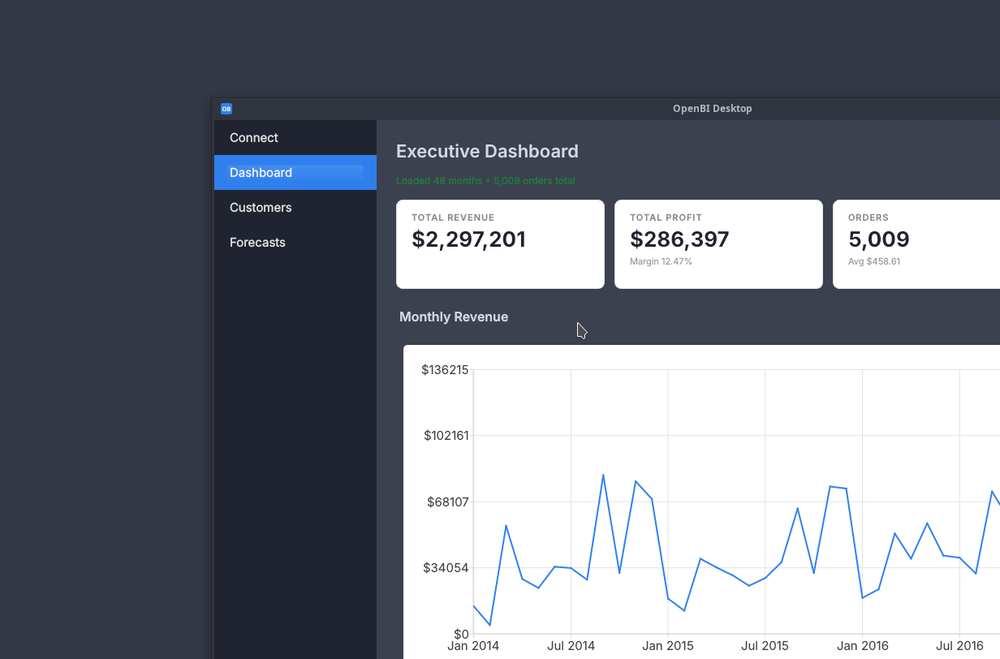

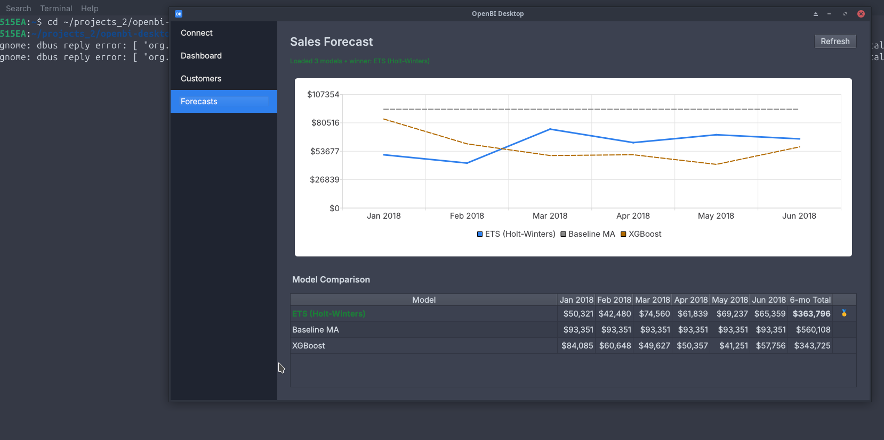

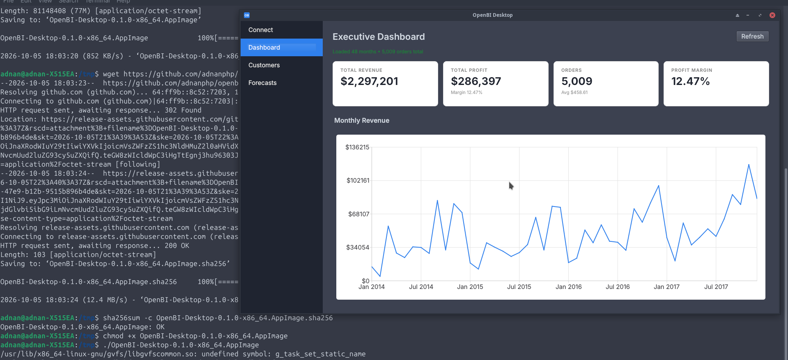

---

# 📥 Installation

## AppImage — Recommended

Download the latest AppImage from the [GitHub Releases page](https://github.com/adnanphp/openbi-desktop/releases/latest).

Or download it directly:

```bash
wget https://github.com/adnanphp/openbi-desktop/releases/latest/download/OpenBI-Desktop-0.1.0-x86_64.AppImage

chmod +x OpenBI-Desktop-0.1.0-x86_64.AppImage

./OpenBI-Desktop-0.1.0-x86_64.AppImage
```

### FUSE Requirement

The AppImage requires **FUSE 2**.

On Ubuntu/Debian:

```bash
sudo apt install libfuse2
```

On Fedora:

```bash
sudo dnf install fuse2
```

OpenBI Desktop is intended to run on:

* Ubuntu 22.04+
* Fedora 38+
* Debian 12+
* Other modern Linux distributions supporting the required dependencies

---

# 🔐 Verify the Download

The release includes a SHA-256 checksum.

Download the checksum:

```bash
wget https://github.com/adnanphp/openbi-desktop/releases/latest/download/OpenBI-Desktop-0.1.0-x86_64.AppImage.sha256
```

Verify the AppImage:

```bash
sha256sum -c OpenBI-Desktop-0.1.0-x86_64.AppImage.sha256
```

A successful verification should report:

```text
OpenBI-Desktop-0.1.0-x86_64.AppImage: OK
```

---

# 🔌 Connect to OpenBI

OpenBI Desktop requires a **running OpenBI backend**.

On first launch, enter the OpenBI API URL:

```text
http://localhost:8000
```

The desktop application then communicates with the FastAPI backend to retrieve KPIs, customer segments, forecasts, and monthly revenue data.

For backend installation and configuration, see the main [OpenBI repository](https://github.com/adnanphp/openbi).

---

# 🛠️ Development

Clone the repository:

```bash
git clone https://github.com/adnanphp/openbi-desktop.git
cd openbi-desktop
```

Create a virtual environment:

```bash
python3 -m venv .venv
source .venv/bin/activate
```

Install the project with development dependencies:

```bash
pip install -e ".[dev]"
```

Run the application:

```bash
python -m openbi_desktop
```

---

# 🧪 Tests

Run the test suite with:

```bash
pytest -q
```

---

# 📦 Build the AppImage Locally

## 1. Download appimagetool

```bash
mkdir -p packaging/tools

wget -O packaging/tools/appimagetool-x86_64.AppImage \
  https://github.com/AppImage/appimagetool/releases/download/continuous/appimagetool-x86_64.AppImage

chmod +x packaging/tools/appimagetool-x86_64.AppImage
```

## 2. Build

```bash
VERSION=0.1.0 ./packaging/build-appimage.sh
```

The resulting package will be created in the repository root:

```text
OpenBI-Desktop-0.1.0-x86_64.AppImage
```

---

# 🏗️ Architecture

```text
┌────────────────────────────────────────────────────────────┐
│                    OpenBI Desktop                          │
│                       PySide6 / Qt 6                       │
│                                                            │
│  ┌──────────┬───────────┬───────────┬───────────┐         │
│  │ Connect  │ Dashboard │ Customers │ Forecasts │         │
│  └──────────┴───────────┴───────────┴───────────┘         │
└───────────────────────────┬────────────────────────────────┘
                            │
                            │ HTTP / httpx
                            ▼
┌────────────────────────────────────────────────────────────┐
│                  OpenBI FastAPI Backend                     │
│                                                            │
│  ┌──────────────┬────────────────┬──────────────────┐      │
│  │   /kpis/*    │ /customers/*   │   /forecasts/*   │      │
│  └──────────────┴────────────────┴──────────────────┘      │
└───────────────────────────┬────────────────────────────────┘
                            │
                            ▼
             PostgreSQL · Spark · Kafka · dbt
```

### Request Flow

```text
User
 │
 ▼
PySide6 UI
 │
 ▼
OpenBIClient
 │
 │ HTTP / JSON
 ▼
FastAPI
 │
 ▼
OpenBI Analytics Backend
 │
 ├── PostgreSQL
 ├── Spark
 ├── Kafka
 └── dbt / Analytics / ML
```

This separation keeps the desktop application lightweight while allowing the backend to handle data processing and analytics.

---

# 🧰 Tech Stack

| **Layer**           | **Technology**                         |
| ------------------- | -------------------------------------- |
| **GUI**             | PySide6 / Qt 6                         |
| **HTTP Client**     | httpx                                  |
| **Charts**          | QtCharts                               |
| **Configuration**   | TOML                                   |
| **Config Location** | `~/.config/openbi-desktop/config.toml` |
| **Packaging**       | PyInstaller + appimagetool             |
| **Testing**         | pytest                                 |
| **CI/CD**           | GitHub Actions                         |
| **Distribution**    | Linux AppImage                         |

---

# 📁 Project Structure

```text
openbi-desktop/
│
├── src/openbi_desktop/
│   ├── api/
│   │   └── # OpenBIClient + API models
│   │
│   ├── views/
│   │   └── # Connect, Dashboard, Customers, Forecasts
│   │
│   ├── widgets/
│   │   └── # KPI cards and reusable UI widgets
│   │
│   └── resources/
│       └── # Icons and application resources
│
├── packaging/
│   ├── openbi-desktop.spec
│   ├── openbi-desktop.desktop
│   └── build-appimage.sh
│
├── tests/
│   └── # pytest test suite
│
└── .github/
    └── workflows/
        └── release.yml
            # CI: build + release AppImage
```

---

# 🚀 Release Pipeline

OpenBI Desktop uses GitHub Actions to build and publish the Linux AppImage.

```text
Git Tag / Manual Trigger
          │
          ▼
     GitHub Actions
          │
          ▼
      PyInstaller
          │
          ▼
      AppImage Build
          │
          ▼
     SHA-256 Checksum
          │
          ▼
    GitHub Release
```

The release workflow is defined in:

```text
.github/workflows/release.yml
```

---

# 🔗 Related Projects

### OpenBI

The backend data platform powering OpenBI Desktop:

[github.com/adnanphp/openbi](https://github.com/adnanphp/openbi)

### Technical Write-Up

[How I Built a Two-Tier Data Platform in 9 Phases](https://dev.to/)

A technical write-up covering the OpenBI data platform, including Spark, Kafka, dbt, Airflow, Kubernetes, and related infrastructure.

---

# 📄 License

MIT License — see [`LICENSE`](LICENSE).

---

<p align="center">
  <b>OpenBI Desktop</b>
  <br>
  <sub>
    Native Linux Client · PySide6 · FastAPI · AppImage · GitHub Actions
  </sub>
</p>

